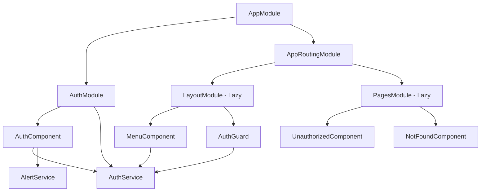

# Silvifrid Admin

Panel de administración web para el sistema Silvifrid, desarrollado con Angular 13.3.7. Esta aplicación proporciona una interfaz de usuario segura y escalable para la gestión administrativa del sistema.

## 📋 Descripción General

**Silvifrid Admin** es una aplicación web administrativa que permite a los usuarios autorizados acceder y gestionar diferentes módulos del sistema Silvifrid. La aplicación cuenta con:

- **Autenticación segura** basada en JWT con encriptación AES
- **Control de acceso** granular mediante permisos
- **Arquitectura modular** con carga perezosa (lazy loading)
- **Interfaz responsive** con Bootstrap 5
- **Manejo centralizado** de alertas y notificaciones

## 🛠️ Tecnologías y Frameworks

### Frontend
- **Angular** 13.3.7 - Framework principal
- **TypeScript** 4.6.2 - Lenguaje de desarrollo
- **Bootstrap** 5.2.2 - Framework CSS para UI responsive
- **SweetAlert2** 11.6.10 - Biblioteca para alertas y modales

### Autenticación y Seguridad
- **@auth0/angular-jwt** 5.1.2 - Manejo de tokens JWT
- **crypto-js** 4.1.1 - Encriptación AES y validación HMAC

### Herramientas de Desarrollo
- **Angular CLI** 13.3.7 - Herramientas de construcción
- **Karma** 6.3.0 + **Jasmine** 4.0.0 - Framework de testing
- **Webpack** - Bundling y optimización

### APIs y Servicios
- **API de Desarrollo**: `http://localhost:4000`

## 🏗️ Arquitectura de la Aplicación

### Estructura Modular

La aplicación sigue el patrón de arquitectura modular de Angular con los siguientes módulos principales:

```
src/app/
├── app.module.ts           # Módulo raíz
├── app-routing.module.ts   # Configuración de rutas principales
├── auth/                   # Módulo de autenticación
├── layout/                 # Módulo de diseño (lazy loaded)
├── pages/                  # Módulo de páginas (lazy loaded)
├── model/                  # Modelos de datos
├── helpers/                # Utilidades y guards
└── alerts/                 # Servicio de alertas
```

### Patrón de Diseño

1. **Módulos Lazy Loaded**: Los módulos `layout` y `pages` se cargan bajo demanda
2. **Guards de Autenticación**: Protección de rutas con `AuthGuard`
3. **Servicios Singleton**: Servicios compartidos con `providedIn: 'root'`
4. **Reactive Forms**: Formularios reactivos para validación

## 📊 Modelo de Datos

### AdmUser (Usuario Administrativo)
```typescript
class AdmUser {
  id: string                    // Identificador único
  userName: string              // Nombre de usuario
  name: string                  // Nombre completo
  position: string              // Cargo/posición
  permissions: Array<string>    // Lista de permisos (IDs)
  permissionsData: Array<Permission> // Datos completos de permisos
}
```

### Permission (Permiso)
```typescript
class Permission {
  name: string                  // Nombre del permiso
  url: string                   // URL de destino
  hasRedirectProtection: boolean // Requiere token en URL
  caption: string               // Texto descriptivo
}
```

## 📁 Módulos y Clases

### Módulo de Autenticación (`auth/`)
| Clase/Archivo | Tipo | Responsabilidad |
|---------------|------|-----------------|
| `AuthModule` | NgModule | Configuración del módulo de autenticación |
| `AuthComponent` | Component | Formulario de login y manejo de autenticación |
| `AuthService` | Service | Lógica de autenticación, encriptación y JWT |

### Módulo de Layout (`layout/`)
| Clase/Archivo | Tipo | Responsabilidad |
|---------------|------|-----------------|
| `LayoutModule` | NgModule | Configuración del módulo de diseño |
| `MenuComponent` | Component | Menú principal basado en permisos |

### Módulo de Páginas (`pages/`)
| Clase/Archivo | Tipo | Responsabilidad |
|---------------|------|-----------------|
| `PagesModule` | NgModule | Configuración de páginas misceláneas |
| `UnauthorizedComponent` | Component | Página de acceso no autorizado |
| `NotFoundComponent` | Component | Página de error 404 |

### Helpers y Utilidades (`helpers/`)
| Clase/Archivo | Tipo | Responsabilidad |
|---------------|------|-----------------|
| `AuthGuard` | CanActivate | Guard para protección de rutas |

### Servicios Globales
| Clase/Archivo | Tipo | Responsabilidad |
|---------------|------|-----------------|
| `AlertService` | Service | Manejo centralizado de alertas |

## 🔗 Relaciones entre Módulos



### Flujo de Autenticación
1. **Login**: `AuthComponent` → `AuthService.auth()`
2. **Encriptación**: Credenciales → AES → Token JWT
3. **Validación**: `AuthGuard` → `AuthService.verifyToken()`
4. **Acceso**: Verificación de permisos → Navegación a módulos

## 🚀 Configuración y Despliegue

### Requisitos Previos
- Node.js 16+ 
- npm 7+
- Angular CLI 13.3.7

### Instalación
```bash
# Clonar repositorio
git clone [repository-url]
cd silvifrid-app

# Instalar dependencias
npm install

# Instalar Angular CLI (si no está instalado)
npm install -g @angular/cli@13.3.7
```

### Desarrollo
```bash
# Servidor de desarrollo (puerto 4300)
npm start
# o
ng serve

# Modo watch para desarrollo
npm run watch
```

### Testing
```bash
# Ejecutar pruebas unitarias
npm test

# Ejecutar pruebas en modo headless
npm test -- --watch=false --browsers=ChromeHeadless
```

### Construcción
```bash
# Build de desarrollo
ng build

# Build de producción
ng build --configuration production
```

## 🔧 Configuración de Entornos

### Desarrollo (`environment.ts`)
```typescript
export const environment = {
  production: false,
  api_url: "http://localhost:4000",
  secret: "SILVIA_JULIANA"
};
```

### Producción (`environment.prod.ts`)
```typescript
export const environment = {
  production: true,
  api_url: "https://silvifrid-gateway.vercel.app",
  secret: "SILVIA_JULIANA"
};
```

## 🔐 Seguridad

### Características de Seguridad
- **Encriptación AES** para transmisión de credenciales
- **Verificación HMAC-SHA256** de tokens JWT personalizados
- **Validación de expiración** de tokens
- **Control de acceso** basado en permisos granulares
- **Protección de rutas** mediante guards

### Flujo de Seguridad
1. Credenciales → Encriptación AES → Envío al servidor
2. Servidor → Validación → Generación de JWT personalizado
3. Cliente → Almacenamiento seguro → Verificación HMAC
4. Cada navegación → Validación de token y permisos

## 📈 Escalabilidad y Extensión

### Para Agregar Nuevos Módulos
1. Crear módulo con `ng generate module nombre-modulo`
2. Configurar lazy loading en `app-routing.module.ts`
3. Agregar protección con `AuthGuard` si es necesario
4. Definir permisos correspondientes en el backend

### Para Nuevos Componentes
1. Usar Angular CLI: `ng generate component nombre-componente`
2. Registrar en el módulo correspondiente
3. Configurar rutas si es necesario
4. Implementar tests unitarios

### Para Nuevos Servicios
1. Generar con: `ng generate service nombre-servicio`
2. Configurar con `providedIn: 'root'` para singleton
3. Inyectar dependencias necesarias
4. Escribir tests de unidad

### Consideraciones de Performance
- **Lazy Loading**: Módulos se cargan bajo demanda
- **Tree Shaking**: Webpack elimina código no utilizado
- **Optimización de Bundle**: Configurado para producción
- **Caching de HTTP**: Implementar interceptors para caching

## 🐛 Debugging y Monitoreo

### Herramientas de Desarrollo
- **Angular DevTools**: Para debugging de componentes
- **Redux DevTools**: Para manejo de estado (si se implementa)
- **Browser DevTools**: Para debugging general

### Logging
- Console.log para desarrollo
- Implementar servicio de logging para producción
- Captura de errores con manejo centralizado

## 📚 Documentación Adicional

Para información más detallada, consultar:
- [Documentación de Arquitectura](docs/ARCHITECTURE.md)
- [Guía de API](docs/API.md)
- [Manual de Desarrollo](docs/DEVELOPMENT.md)
- [Guía de Despliegue](docs/DEPLOYMENT.md)

## 🤝 Contribución

1. Fork el proyecto
2. Crear rama feature (`git checkout -b feature/nueva-funcionalidad`)
3. Commit cambios (`git commit -am 'Agregar nueva funcionalidad'`)
4. Push a la rama (`git push origin feature/nueva-funcionalidad`)
5. Crear Pull Request

## 📄 Licencia

Este proyecto está bajo la licencia [especificar licencia].

---

**Desarrollado con ❤️ para el sistema Silvifrid**
