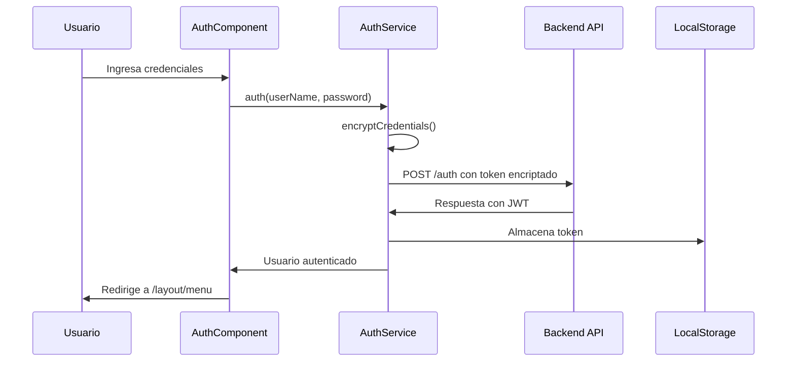
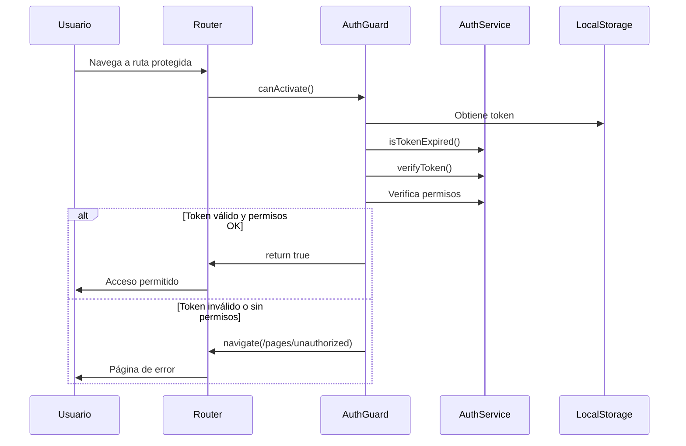

# Arquitectura del Sistema Silvifrid Admin

## Introducción

Este documento describe la arquitectura detallada de la aplicación Silvifrid Admin, incluyendo patrones de diseño, estructura de módulos, flujo de datos y decisiones arquitectónicas.

## Arquitectura General

### Patrón Arquitectónico

La aplicación sigue el patrón **Modular Monolítico** con características de **Micro-frontend**, donde:

- Cada módulo funcional es independiente
- Los módulos se cargan de forma perezosa (lazy loading)
- Comunicación entre módulos a través de servicios compartidos
- Separación clara de responsabilidades

```
┌─────────────────────────────────────────────────────────────┐
│                    NAVEGADOR (Cliente)                      │
│  ┌─────────────────────────────────────────────────────────┐│
│  │                Angular Application                      ││
│  │  ┌─────────────┐  ┌─────────────┐  ┌─────────────┐    ││
│  │  │ Auth Module │  │Layout Module│  │Pages Module │    ││
│  │  │             │  │             │  │             │    ││
│  │  │ - Login     │  │ - Menu      │  │ - 404       │    ││
│  │  │ - Guards    │  │ - Nav       │  │ - 401       │    ││
│  │  └─────────────┘  └─────────────┘  └─────────────┘    ││
│  │           │              │              │             ││
│  │  ┌─────────────────────────────────────────────────────┐││
│  │  │              Shared Services                       │││
│  │  │  - AuthService  - AlertService  - HTTP Client     │││
│  │  └─────────────────────────────────────────────────────┘││
│  └─────────────────────────────────────────────────────────┘│
└─────────────────────────────────────────────────────────────┘
                           │ HTTPS/WSS
┌─────────────────────────────────────────────────────────────┐
│                    API Gateway                              │
│                (silvifrid-gateway)                          │
└─────────────────────────────────────────────────────────────┘
```

## Estructura de Módulos

### 1. App Module (Módulo Raíz)

**Responsabilidades:**
- Bootstrapping de la aplicación
- Configuración de routing principal
- Importación de módulos core

**Archivos:**
- `app.module.ts` - Configuración del módulo raíz
- `app-routing.module.ts` - Rutas principales
- `app.component.ts` - Componente raíz

### 2. Auth Module (Módulo de Autenticación)

**Responsabilidades:**
- Manejo de login/logout
- Gestión de tokens JWT
- Encriptación de credenciales
- Validación de sesiones

**Componentes:**
```typescript
AuthModule
├── AuthComponent
│   ├── Formulario de login
│   ├── Validación de campos
│   └── Manejo de errores
├── AuthService
│   ├── auth(userName, password)
│   ├── encryptCredentials()
│   ├── verifyToken()
│   └── getUserFromLocalStorage()
└── AuthGuard
    ├── canActivate()
    ├── Verificación de token
    └── Validación de permisos
```

### 3. Layout Module (Módulo de Diseño)

**Responsabilidades:**
- Estructura visual de la aplicación
- Sistema de navegación
- Menús basados en permisos

**Componentes:**
```typescript
LayoutModule
└── MenuComponent
    ├── Renderizado de menú
    ├── Filtrado por permisos
    └── Navegación dinámica
```

### 4. Pages Module (Módulo de Páginas)

**Responsabilidades:**
- Páginas de error y estado
- Manejo de rutas no encontradas
- Páginas de acceso denegado

**Componentes:**
```typescript
PagesModule
├── UnauthorizedComponent
│   └── Página 401 - Acceso denegado
└── NotFoundComponent
    └── Página 404 - No encontrado
```

## Flujo de Datos

### 1. Flujo de Autenticación



### 2. Flujo de Navegación Protegida



## Gestión del Estado

### Estado Local (Componentes)

Cada componente maneja su estado local usando:
- **Reactive Forms** para formularios
- **Propiedades privadas** para estado interno
- **ViewChild/ViewChildren** para referencias DOM

### Estado Compartido (Servicios)

```typescript
// AuthService - Estado de autenticación
public userSubject = new BehaviorSubject<AdmUser>(new AdmUser());

// Patrón Observable para comunicación
getUserStream(): Observable<AdmUser> {
    return this.userSubject.asObservable();
}
```

## Seguridad en la Arquitectura

### 1. Capas de Seguridad

```
┌─────────────────────────────────────────┐
│           Capa de Presentación          │
│  - Validación de formularios            │
│  - Sanitización de inputs               │
└─────────────────────────────────────────┘
                    │
┌─────────────────────────────────────────┐
│            Capa de Routing              │
│  - AuthGuard en rutas protegidas        │
│  - Validación de permisos               │
└─────────────────────────────────────────┘
                    │
┌─────────────────────────────────────────┐
│           Capa de Servicios             │
│  - Encriptación AES de credenciales     │
│  - Verificación HMAC de tokens          │
│  - Validación de expiración             │
└─────────────────────────────────────────┘
                    │
┌─────────────────────────────────────────┐
│            Capa de Transporte           │
│  - HTTPS obligatorio                    │
│  - Headers de seguridad                 │
└─────────────────────────────────────────┘
```

### 2. Implementación de Seguridad

**Encriptación de Credenciales:**
- Utiliza algoritmo AES para encriptar credenciales de usuario
- Emplea clave secreta del entorno para la encriptación
- Convierte las credenciales a formato JSON antes de encriptar

**Verificación de Token JWT:**
- Implementa verificación personalizada de tokens JWT
- Utiliza algoritmo HMAC-SHA256 para validación de firma
- Compara firmas computadas con las recibidas para autenticación

## Patrones de Diseño Implementados

### 1. Singleton Pattern
- **AuthService**: Una sola instancia para toda la aplicación
- **AlertService**: Servicio global para notificaciones

### 2. Guard Pattern
- **AuthGuard**: Protección de rutas con lógica centralizada

### 3. Observer Pattern
- **BehaviorSubject**: Para estado reactivo del usuario
- **Reactive Forms**: Para manejo de estado de formularios

### 4. Factory Pattern
- **Angular Dependency Injection**: Creación automática de instancias

### 5. Module Pattern
- **Angular Modules**: Encapsulación de funcionalidades

## Decisiones Arquitectónicas

### 1. Lazy Loading de Módulos

**Decisión:** Implementar carga perezosa para módulos no críticos

**Justificación:**
- Mejora tiempo de carga inicial
- Reduce tamaño del bundle principal
- Mejor experiencia de usuario

**Implementación:**
- Configuración de rutas con lazy loading para módulos principales
- Carga diferida de LayoutModule y PagesModule
- Optimización de rendimiento mediante importación dinámica

### 2. JWT Personalizado vs Estándar

**Decisión:** Implementar verificación personalizada de JWT

**Justificación:**
- Mayor control sobre la validación
- Implementación de firma HMAC personalizada
- Flexibilidad en el manejo de tokens

**Consideración:** Puede complicar la interoperabilidad con otros sistemas

### 3. Encriptación en el Cliente

**Decisión:** Encriptar credenciales en el frontend antes del envío

**Justificación:**
- Protección adicional en tránsito
- Evita exposición de credenciales en logs
- Defensa en profundidad

### 4. Bootstrap vs Material Design

**Decisión:** Usar Bootstrap 5.2.2

**Justificación:**
- Familiaridad del equipo
- Flexibilidad de personalización
- Menor curva de aprendizaje

## Escalabilidad y Mantenibilidad

### Estrategias de Escalabilidad

1. **Modularización**: Nuevas funcionalidades como módulos independientes
2. **Lazy Loading**: Carga bajo demanda para optimizar performance
3. **Shared Services**: Reutilización de lógica común
4. **Component Libraries**: Componentes reutilizables

### Mantenibilidad

1. **Separación de Responsabilidades**: Cada módulo tiene una función específica
2. **Principio DRY**: Servicios compartidos evitan duplicación
3. **Testing**: Estructura que facilita pruebas unitarias
4. **TypeScript**: Tipado fuerte para prevenir errores

## Recomendaciones para Futuras Mejoras

### 1. Estado Global (NgRx)
Implementar NgRx para aplicaciones más complejas:
```typescript
// Ejemplo de estructura NgRx
interface AppState {
  auth: AuthState;
  user: UserState;
  permissions: PermissionState;
}
```

### 2. Interceptors HTTP
Agregar interceptors para:
- Manejo automático de tokens
- Logging de requests
- Cache de respuestas
- Manejo de errores globales

### 3. Progressive Web App (PWA)
Convertir a PWA para:
- Funcionalidad offline
- Instalación en dispositivos
- Mejor performance

### 4. Micro-frontends
Evolucionar hacia micro-frontends para:
- Desarrollo independiente de módulos
- Despliegue independiente
- Escalabilidad de equipos

## Conclusión

La arquitectura actual proporciona una base sólida y escalable para la aplicación Silvifrid Admin. Las decisiones tomadas balancean simplicidad, seguridad y mantenibilidad, permitiendo futuras expansiones sin refactoring mayor.