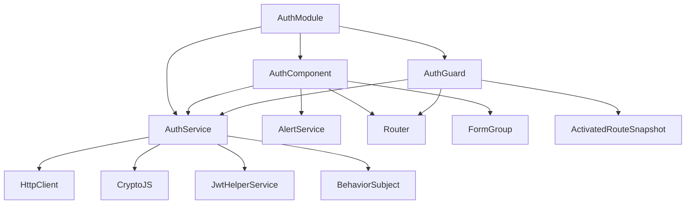
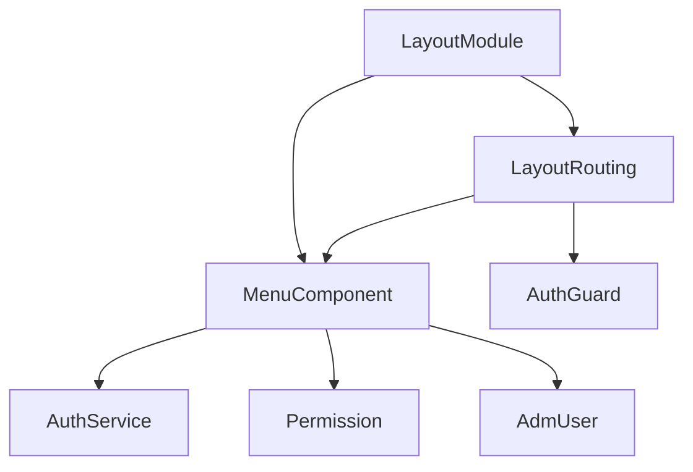
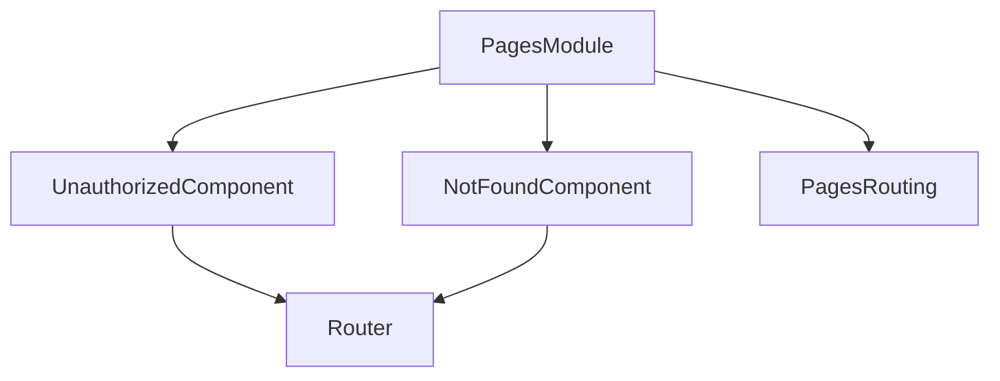
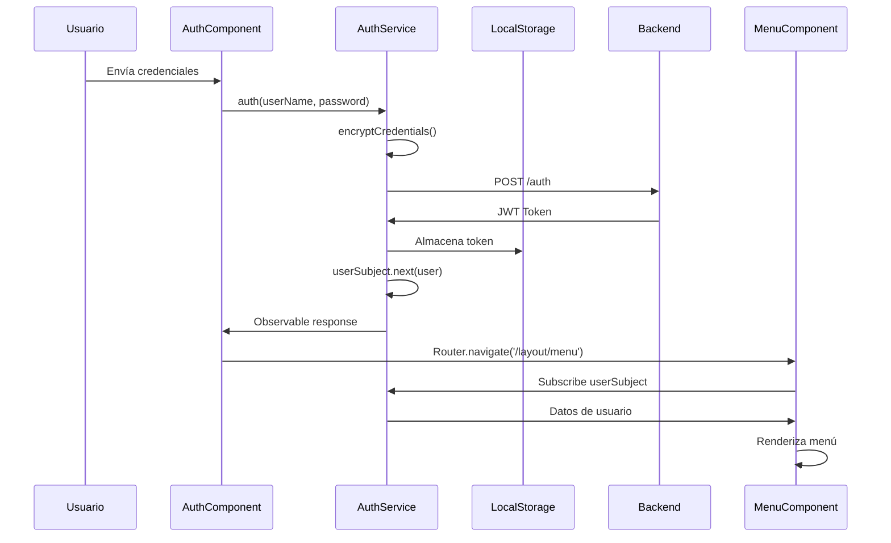
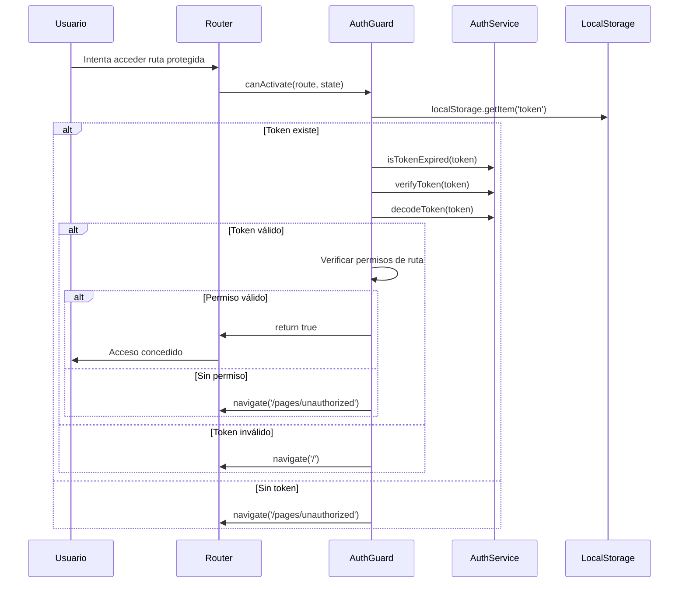
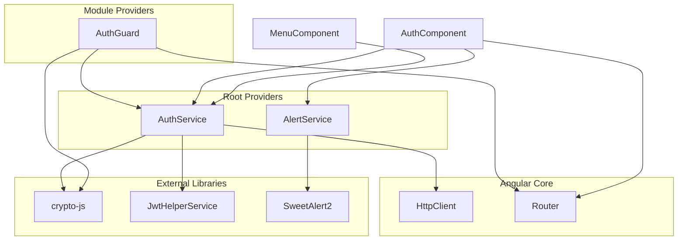

# Relaciones entre Módulos y Clases - Silvifrid Admin

## Introducción

Este documento detalla las relaciones, dependencias e interacciones entre todos los módulos, clases y componentes de la aplicación Silvifrid Admin.

## Mapa de Dependencias Generales

```mermaid
graph TB
    subgraph "Core Angular"
        BM[BrowserModule]
        RC[RouterModule] 
        RF[ReactiveFormsModule]
        HC[HttpClientModule]
        CM[CommonModule]
    end

    subgraph "External Libraries"
        JWT[@auth0/angular-jwt]
        CRY[crypto-js]
        SWT[sweetalert2]
        BS[bootstrap]
    end

    subgraph "Application Modules"
        AM[AppModule]
        AUTH[AuthModule]
        LAY[LayoutModule]
        PAG[PagesModule]
    end

    subgraph "Services"
        AS[AuthService]
        ALS[AlertService]
        AG[AuthGuard]
    end

    subgraph "Models"
        USR[AdmUser]
        PER[Permission]
    end

    AM --> BM
    AM --> RC
    AM --> AUTH
    
    AUTH --> CM
    AUTH --> HC
    AUTH --> RF
    AUTH --> AS
    AUTH --> AG
    
    LAY --> CM
    LAY --> RC
    LAY --> AG
    
    PAG --> CM
    PAG --> RC
    
    AS --> HC
    AS --> JWT
    AS --> CRY
    AS --> USR
    
    ALS --> SWT
    
    AG --> AS
    AG --> CRY
    
    USR --> PER
```

## Matriz de Dependencias Detallada

### Dependencias de Módulos

| Módulo | Depende de | Importa | Proporciona |
|--------|------------|---------|-------------|
| **AppModule** | BrowserModule, RouterModule, AuthModule | AppRoutingModule | AppComponent, Bootstrap |
| **AuthModule** | CommonModule, HttpClientModule, ReactiveFormsModule | FormsModule | AuthComponent, AuthGuard |
| **LayoutModule** | CommonModule, RouterModule | AuthGuard | MenuComponent |
| **PagesModule** | CommonModule, RouterModule | - | UnauthorizedComponent, NotFoundComponent |

### Dependencias de Servicios

| Servicio | Inyecta | Utiliza | Expone |
|----------|---------|---------|---------|
| **AuthService** | HttpClient | crypto-js, @auth0/angular-jwt | auth(), verifyToken(), getUserFromLocalStorage() |
| **AlertService** | - | sweetalert2 | getFailedAlert() |
| **AuthGuard** | Router, AuthService | crypto-js | canActivate() |

## Relaciones por Módulo

### 1. AppModule (Módulo Raíz)

```typescript
@NgModule({
  declarations: [AppComponent],
  imports: [
    BrowserModule,      // ← Angular Core
    AppRoutingModule,   // ← Routing local
    AuthModule          // ← Módulo funcional
  ],
  bootstrap: [AppComponent]
})
```

**Relaciones:**
- **Bootstrapea**: `AppComponent`
- **Importa**: Módulos core y funcionales
- **Configura**: Routing principal

**Dependencias Externas:**
- `@angular/platform-browser`
- `@angular/router`

### 2. AuthModule (Autenticación)



**Componentes y sus Dependencias:**

#### AuthComponent
```typescript
class AuthComponent {
  constructor(
    private authService: AuthService,      // ← Lógica de autenticación
    private alertService: AlertService,    // ← Notificaciones
    private router: Router                 // ← Navegación
  ) {}
}
```

**Responsabilidades:**
- Renderizar formulario de login
- Validar credenciales localmente
- Delegar autenticación a `AuthService`
- Manejar respuestas y errores
- Redirigir después del login

#### AuthService
```typescript
class AuthService {
  private jwtHelperService = new JwtHelperService();
  public userSubject = new BehaviorSubject<AdmUser>(new AdmUser());

  constructor(private httpClient: HttpClient) {}
}
```

**Relaciones:**
- **Consume**: `HttpClient` para requests HTTP
- **Utiliza**: `crypto-js` para encriptación
- **Utiliza**: `@auth0/angular-jwt` para manejo JWT
- **Publica**: `BehaviorSubject<AdmUser>` para estado reactivo
- **Retorna**: `Observable` para operaciones asíncronas

#### AuthGuard
```typescript
class AuthGuard implements CanActivate {
  constructor(
    private router: Router,
    private authService: AuthService
  ) {}
}
```

**Dependencias:**
- **AuthService**: Para validación de tokens
- **Router**: Para redirecciones
- **ActivatedRouteSnapshot**: Para datos de ruta
- **CryptoJS**: Para verificación de firmas

### 3. LayoutModule (Diseño)



#### MenuComponent
```typescript
class MenuComponent {
  permissionsAsMenu!: Array<Permission>;
  user!: AdmUser;

  constructor(private authService: AuthService) {}
}
```

**Relaciones:**
- **Observa**: `AuthService.userSubject` para datos de usuario
- **Utiliza**: `Permission[]` para renderizar menú
- **Depende**: localStorage para tokens
- **Filtra**: Permisos basados en usuario actual

### 4. PagesModule (Páginas Misceláneas)



**Componentes Simples:**
- **UnauthorizedComponent**: Página estática de error 401
- **NotFoundComponent**: Página estática de error 404

## Flujos de Datos entre Componentes

### 1. Flujo de Autenticación



### 2. Flujo de Protección de Rutas



### 3. Flujo de Estado Reactivo

```mermaid
graph LR
    AS[AuthService] --> BS[BehaviorSubject]
    BS --> MC[MenuComponent]
    BS --> AC[AuthComponent]
    BS --> AG[AuthGuard]
    
    subgraph "Estado Compartido"
        BS --> |userSubject| USR[AdmUser]
        USR --> PER[Permission[]]
    end
```

## Inyección de Dependencias

### Grafo de Dependencias de Servicios



### Configuración de Providers

```typescript
// AuthModule providers
@NgModule({
  providers: [
    AuthGuard,  // Específico del módulo
    // AuthService se proporciona en 'root'
    // AlertService se proporciona en 'root'
  ]
})

// Servicios con providedIn: 'root'
@Injectable({ providedIn: 'root' })
export class AuthService { }

@Injectable({ providedIn: 'root' })
export class AlertService { }
```

## Interfaces y Contratos

### Interfaces de Comunicación

```typescript
// Contrato entre AuthService y componentes
interface AuthServiceContract {
  // Observables
  userSubject: BehaviorSubject<AdmUser>;
  
  // Métodos públicos
  auth(userName: string, password: string): Observable<any>;
  verifyToken(jwt: string): boolean;
  isTokenExpired(token: string): boolean;
  decodeToken(token: string): any;
  getUserFromLocalStorage(): any;
  encryptCredentials(userName: string, password: string): any;
}

// Contrato entre AuthGuard y servicios
interface CanActivateContract {
  canActivate(
    route: ActivatedRouteSnapshot,
    state: RouterStateSnapshot
  ): boolean | Observable<boolean> | Promise<boolean>;
}

// Contrato de datos entre componentes
interface UserDataContract {
  user: AdmUser;
  permissions: Permission[];
  token: string;
}
```

## Patrones de Comunicación

### 1. Parent-Child Communication

```typescript
// No hay comunicación directa parent-child en la app actual
// Toda la comunicación se hace a través de servicios compartidos
```

### 2. Service-Based Communication

```typescript
// Patrón Observable para comunicación reactiva
class AuthService {
  private userSubject = new BehaviorSubject<AdmUser>(new AdmUser());
  
  // Múltiples componentes pueden suscribirse
  getUserStream(): Observable<AdmUser> {
    return this.userSubject.asObservable();
  }
  
  // Cualquier componente puede actualizar el estado
  updateUser(user: AdmUser): void {
    this.userSubject.next(user);
  }
}
```

### 3. Event-Based Communication

```typescript
// Usando Router para comunicación entre módulos
class AuthComponent {
  async onSubmit() {
    // ...lógica de autenticación...
    this.router.navigate(['/layout/menu']); // Navegación como evento
  }
}
```

## Acoplamiento y Cohesión

### Análisis de Acoplamiento

| Módulo/Clase | Nivel de Acoplamiento | Dependencias | Observaciones |
|--------------|----------------------|--------------|---------------|
| **AppModule** | Bajo | 3 módulos | Solo dependencias necesarias |
| **AuthModule** | Medio | 4 módulos + libs | Acoplado a crypto y JWT |
| **AuthService** | Alto | 5 dependencias | Hub central de autenticación |
| **AuthGuard** | Medio | 2 servicios + libs | Dependiente de AuthService |
| **MenuComponent** | Bajo | 1 servicio | Bien encapsulado |
| **AlertService** | Muy Bajo | 1 librería | Altamente reutilizable |

### Recomendaciones de Mejora

#### Reducir Acoplamiento en AuthService

```typescript
// ❌ Actual - Alto acoplamiento
class AuthService {
  constructor(private httpClient: HttpClient) {}
  
  auth() {
    // Lógica HTTP, encriptación, JWT todo mezclado
  }
}

// ✅ Propuesta - Separación de responsabilidades
class AuthService {
  constructor(
    private httpClient: HttpClient,
    private cryptoService: CryptoService,      // ← Extraer
    private tokenService: TokenService        // ← Extraer
  ) {}
}

@Injectable({ providedIn: 'root' })
class CryptoService {
  encryptCredentials(data: any): string { }
  verifySignature(token: string): boolean { }
}

@Injectable({ providedIn: 'root' })
class TokenService {
  isExpired(token: string): boolean { }
  decode(token: string): any { }
}
```

## Extensibilidad

### Puntos de Extensión

#### 1. Nuevos Módulos

```typescript
// Patrón para agregar nuevos módulos
const routes: Routes = [
  // Existentes
  {path: "layout", loadChildren: ()=>import('./layout/layout.module').then(m=>m.LayoutModule)},
  {path: "pages", loadChildren: ()=> import('./pages/pages.module').then(m=>m.PagesModule)},
  
  // Nuevos módulos siguen el mismo patrón
  {path: "users", loadChildren: ()=> import('./users/users.module').then(m=>m.UsersModule)},
  {path: "reports", loadChildren: ()=> import('./reports/reports.module').then(m=>m.ReportsModule)}
];
```

#### 2. Nuevos Servicios

```typescript
// Los nuevos servicios pueden inyectar servicios existentes
@Injectable({ providedIn: 'root' })
export class UserManagementService {
  constructor(
    private authService: AuthService,  // ← Reutilizar
    private httpClient: HttpClient
  ) {}
}
```

#### 3. Nuevos Guards

```typescript
// Extender el patrón de guards existente
@Injectable()
export class RoleGuard implements CanActivate {
  constructor(
    private authService: AuthService,  // ← Reutilizar lógica
    private router: Router
  ) {}
  
  canActivate(route: ActivatedRouteSnapshot): boolean {
    const requiredRole = route.data['role'];
    const user = this.authService.getUserFromLocalStorage();
    
    if (user && user.position === requiredRole) {
      return true;
    }
    
    this.router.navigate(['/pages/unauthorized']);
    return false;
  }
}
```

## Testing de Relaciones

### Mocking de Dependencias

```typescript
describe('AuthComponent', () => {
  let component: AuthComponent;
  let authService: jasmine.SpyObj<AuthService>;
  let alertService: jasmine.SpyObj<AlertService>;
  let router: jasmine.SpyObj<Router>;

  beforeEach(() => {
    const authSpy = jasmine.createSpyObj('AuthService', ['auth']);
    const alertSpy = jasmine.createSpyObj('AlertService', ['getFailedAlert']);
    const routerSpy = jasmine.createSpyObj('Router', ['navigate']);

    TestBed.configureTestingModule({
      declarations: [AuthComponent],
      providers: [
        { provide: AuthService, useValue: authSpy },
        { provide: AlertService, useValue: alertSpy },
        { provide: Router, useValue: routerSpy }
      ]
    });
  });

  it('should call authService.auth on submit', () => {
    // Test de relación entre AuthComponent y AuthService
    component.onSubmit();
    expect(authService.auth).toHaveBeenCalled();
  });
});
```

## Documentación de Cambios

### Impacto de Modificaciones

| Cambio en | Afecta a | Tipo de Impacto | Pruebas Requeridas |
|-----------|----------|-----------------|-------------------|
| **AdmUser model** | AuthService, MenuComponent | Estructural | Unit + Integration |
| **AuthService.auth()** | AuthComponent, AuthGuard | Funcional | Unit + E2E |
| **Environment config** | AuthService | Configuración | Integration |
| **Routing structure** | AuthGuard, Components | Navegación | E2E |

### Versionado de Interfaces

```typescript
// Mantener compatibilidad hacia atrás
interface AuthServiceV1 {
  auth(userName: string, password: string): Observable<any>;
}

interface AuthServiceV2 extends AuthServiceV1 {
  authWithTwoFactor(userName: string, password: string, code: string): Observable<any>;
}
```

Este documento proporciona una visión completa de las relaciones e interdependencias en la aplicación Silvifrid Admin, facilitando el mantenimiento y la extensión del sistema.